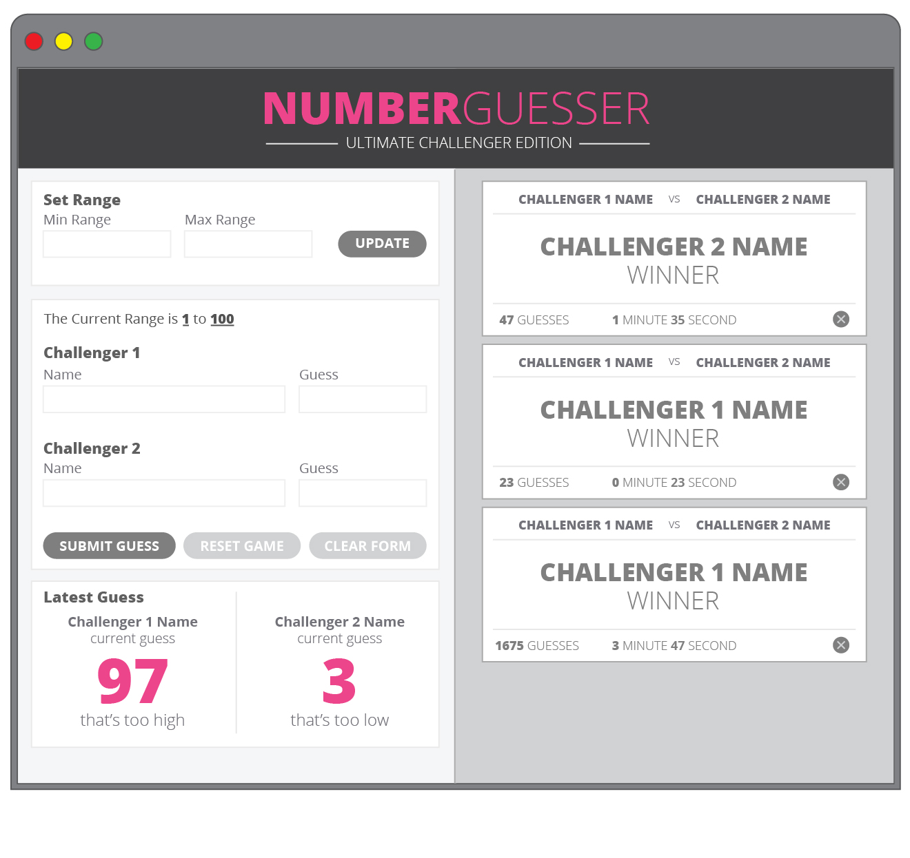

# number_guesser

Group Member Names: Harry Borrelli & Lili Manrique

App Description  
--Number Guesser is a two player game that creates a random number between a specified range that can be altered by the players. Players are given hints indicating whether their guess was too high or too low. If a player tried to set a maximum range that is higher than the minimum or if they try to guess a value that is outside of the range, they will see an error message. When a player wins the game, they get a message of "BOOM!" and a new card is displayed on the right which shows who won the game, how many guesses it took to correctly guess the random number, and how much time it took to get that answer. Once a game has been won, the range automatically widens by ten on either end unless the game is reset or a new range is set.

Our Finished App  

  

Comp  

   

DTR  

Goals and Expectations for the Project (What does each group member hope to get out of this project? What do we want to achieve as a team? How will we know that we're successful?):  
-- To be collaborative and enjoy the struggle, and learn more JavaScript! We would like to get more comfortable writing more concise code. Expressive commits.

How we can use our strengths to overcome obstacles:  
-- Lili can hold Harry more accountable for more frequent commits and communication.

Schedule Expectations (When are we available to work together and individually? What constraints do we have?):  
-- Complete a bulk of the paired work after class.

Communication Expectations (How and often will we communicate? How do we keep lines of communication open? How will we make decisions as a team?):  
-- Daily checkins on project status. We will define a time as we get moving.

Abilities & Growth Expectations (Technical strengths and areas for desired improvement):  
-- Writing better formatted code (grammar, semantics, etc.).

Workload Expectations (What features do we each want to work on?):  
--We expect to take turns working on layout vs functionality

Workflow Expectations (Git workflow/Tools/Code Review/Reviewing Pull Requests/Debugging and Problem-solving Techniques):  
-- Discuss features we want to implement before coding them in.

Expectations for giving and receiving feedback:  
-- Communicate frequently and openly. Be honest but considerate.

Project management tools we will use (GitHub projects or Trello are popular tools):  
-- Look into Trello, and Github for collaboration.
